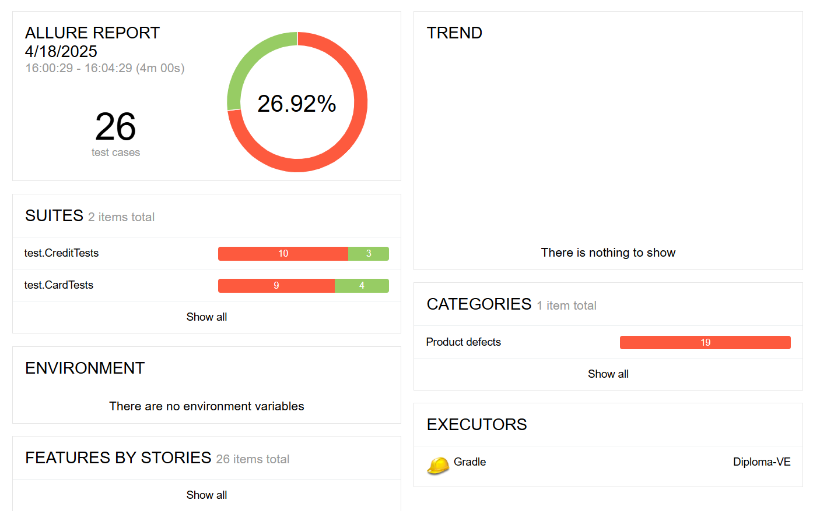

## Отчет о проведенном тестировании
### Краткое описание
Было проведено тестирование приложения "Путешествие дня" - веб-сервиса, который предлагает купить тур по определённой цене двумя способами:

- Обычная оплата по дебетовой карте.
- Уникальная технология: выдача кредита по данным банковской карты.

Составленный план автоматизации (Plan.md) был реализован в UI-тестах на дебетовую и кредитную карту, а также составлены автоматизированные запросы в БД для проверки корректности внесения приложением данных.
Также, в качестве системы отчетности в проект подключена система Allure, запуск которой описан в README.md.
По итогам автоматизации составлены 18 баг-репортов.

### Количество тест-кейсов
Всего реализовано 26 кейсов, неуспешных - 18, успешных - 8.
Процент успешных - 26.92% и не успешных тест-кейсов - 73.07%;

### Общие рекомендации
- Сделать правки в приложении в соответствии с баг-репортами.
- Сделать документацию для уточнения требований к приложению.
- Для удобства и стабильности в поддержке автоматизации тестирования добавить тестовые идентификаторы в поля, кнопки, уведомления.